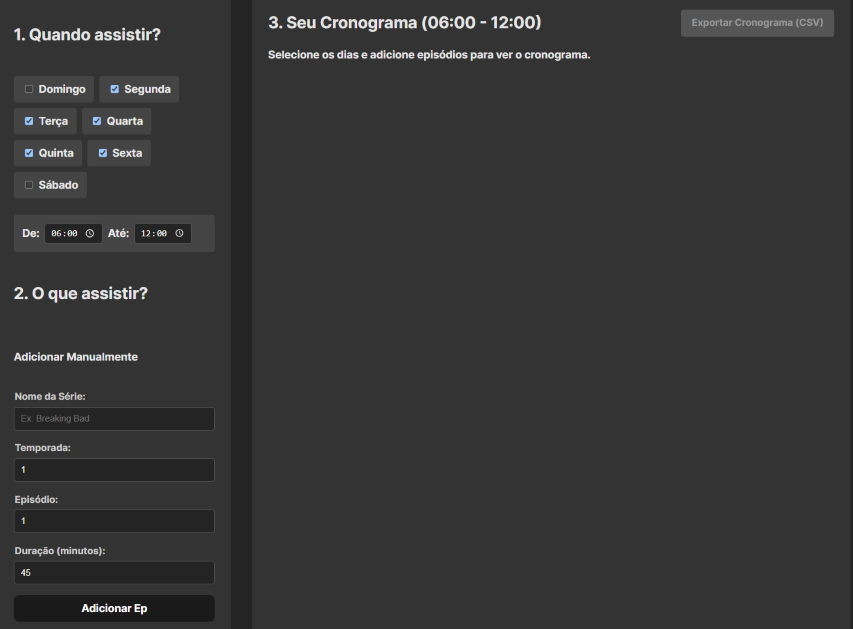

# 🍿 Calculadora de Maratona de Séries

Este é um aplicativo web de página única (SPA) criado em **React + Vite** para calcular automaticamente um cronograma de maratona de séries.

O usuário pode definir uma lista de episódios (manualmente ou via CSV), os dias da semana e o intervalo de horário desejado. O aplicativo exibe instantaneamente uma tabela com o cronograma completo, que pode ser exportado para um arquivo `.csv`.

## 🚀 Link do site

**[https://marathon-calculator-ph.vercel.app/]** *

## ✨ Funcionalidades Principais

* **Entrada Manual:** Adicione episódios um por um com um formulário inteligente que auto-incrementa o número do episódio.
* **Importação via CSV:** Carregue uma lista de episódios em massa.
* **Validação de CSV:** O app valida se o CSV contém os cabeçalhos corretos (`Serie`, `Temporada`, `Episodio`, `Duracao`) e informa o usuário em caso de erro.
* **Seleção de Dias:** Escolha quais dias da semana deseja assistir (inicia com Seg-Sex como padrão).
* **Horário Personalizado:** Defina um bloco de horário personalizado (ex: de `06:00` até `12:00`).
* **Cálculo Automático:** A tabela de cronograma é atualizada em tempo real. A lógica ordena os episódios e respeita os blocos de horário, pulando para o próximo dia válido.
* **Exportação para CSV:** Exporte o cronograma final com um clique. O botão fica desabilitado até que um cronograma seja gerado.
* **Sessão Limpa:** O aplicativo não armazena dados entre as sessões (não usa `localStorage`), começando limpo a cada recarga.
* **Localização:** Datas e dias da semana exibidos em Português (pt-BR).

## 📷 Visualização



## 🛠️ Tecnologias Utilizadas

* **React** (com Hooks `useState` e `useEffect`)
* **Vite** (Build tool de front-end)
* **date-fns** (Para toda a manipulação de datas e horários)
* **papaparse** (Para a importação e leitura de CSV)
* **react-csv** (Para a exportação de dados para CSV)
* **CSS Puro** (Para estilização)

## 📖 Como Usar

1.  **Defina seu Horário:** Na seção "1. Quando assistir?", selecione os dias da semana e o intervalo de horário (início e fim) que você tem disponível.
2.  **Adicione Episódios:** Na seção "2. O que assistir?":
    * **Manual:** Preencha os campos e clique em "Adicionar Ep". O campo "Episódio" aumentará sozinho, permitindo adicionar sequências rapidamente.
    * **CSV:** Clique em "Escolher arquivo" e importe um `.csv`.
3.  **Formato do CSV:** Para a importação funcionar, seu arquivo `.csv` **deve** conter exatamente estes cabeçalhos na primeira linha (sem acentos):
    ```
    Serie,Temporada,Episodio,Duracao
    ```
4.  **Visualize e Exporte:** A tabela na seção "3. Seu Cronograma" será atualizada automaticamente. Quando estiver satisfeito, clique no botão "Exportar Cronograma (CSV)".

**OBS**: No campo Duração (minutos):
* **<60 minutos**: Normal
* **>60 minutos**: Ex: 2h17min = 2 * 60 + 17 = 137 minutos
* **Opcional**: Se você não quiser fazer de cabeça
1. Acesse "https://codepen.io/pen"
2. Copia o código "https://pastebin.com/raw/gJdvmUHP" e cole-o no campo HTML
3. Copia o código "https://pastebin.com/raw/dPdSdDSZ" e cole-o no campo CSS

## ⚙️ Como Rodar o Projeto Localmente

Se você quiser clonar e rodar este projeto na sua máquina:

```bash
# 1. Clone o repositório
git clone [https://github.com/seu-usuario/seu-repositorio.git](https://github.com/seu-usuario/seu-repositorio.git)

# 2. Entre na pasta do projeto
cd marathon-calculator

# 3. Instale as dependências
npm install

# 4. (IMPORTANTE) A biblioteca 'react-csv' exige o 'prop-types'
# Se ele não foi instalado automaticamente, instale-o:
npm install prop-types

# 5. Rode o servidor de desenvolvimento
npm run dev

# 6. Abra http://localhost:5173 (ou a porta indicada) no seu navegador.